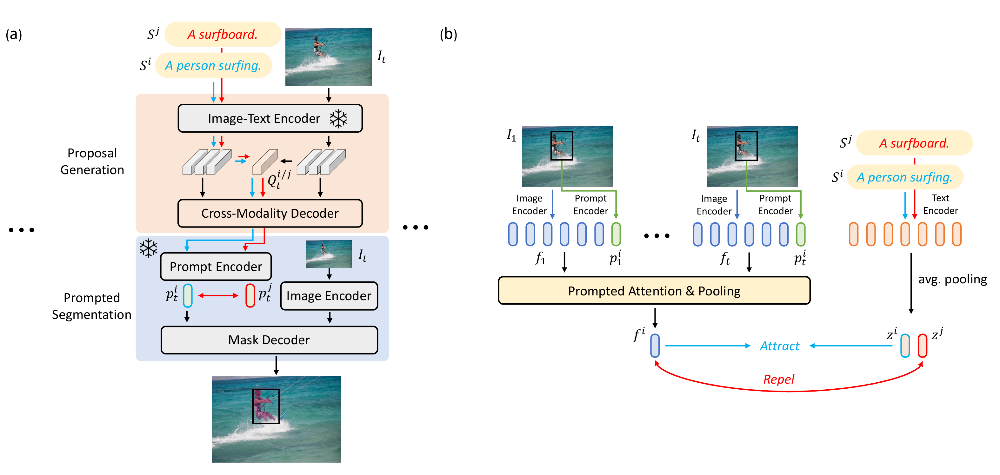

<div align="center">
<h1>
<b>
GroPrompt: Grounded Prompting for Referring Video Object Segmentation
</b>
</h1>
</div>

The official implementation of the **CVPR 2024** under-review paper: 
<p align="center"></p>


> **GroPrompt: Grounded Prompting for Referring Video Object Segmentation**

### Abstract

Referring Video Object Segmentation (RVOS) aims to segment the object referred to by the query sentence throughout the entire video. Most existing methods require end-to-end training with dense mask annotations, which could be computation-consuming and less scalable. In this work, we aim to efficiently adapt foundation segmentation models for addressing RVOS from weak supervision with the proposed Grounded Prompting (GroPrompt) framework. More specifically, we propose Text-Aware Prompt Contrastive Learning (TAP-CL) to enhance the association between the position prompts and the referring sentences with only box supervisions, including Text-Contrastive Prompt Learning (TextCon) and Modality-Contrastive Prompt Learning (ModalCon) at frame level and video level, respectively. With the proposed TAP-CL, our GroPrompt framework can generate temporal-consistent yet text-aware position prompts describing locations and movements for the referred object from the video. The experimental results in the standard RVOS benchmarks (Ref-YouTube-VOS, Ref-DAVIS17, A2D-Sentences, and JHMDB-Sentences) demonstrate the competitive performance of our proposed GroPrompt framework given only bounding box weak supervisions.

## Update
- **(2023/11/18)** GroPrompt is under reviewed by CVPR2024.

## DEMO
### TBD

## Environment setup steps
Please refer to [data.md](docs/data.md) for data preparation.

1. Install conda env. with `conda env create --name *env_name* python=3.8`
2. Please run the install.sh script to install the required packages.
    ```
    sh ./install.sh
    ```

## Training and Evaluation
### Training
* Prepare data & pre-trained model weight.
    * Please download pre-trained weight from the [link](https://download.openmmlab.com/mmdetection/v3.0/grounding_dino/groundingdino_swinb_cogcoor_mmdet-55949c9c.pth)
    * The saved path should be `"R-VOS/mm_weights/groundingdino_swinb_cogcoor_mmdet-55949c9c.pth"` (if you change it, you should refer to the path in the config file, which is under `"R-VOS/mmdetection/configs/grounding_dino/XXX.py"`)
* Run the following command:
    ```bash
    # train on single GPU
    python mmdetection/tools/train.py $config_path --work-dir $output_path --auto-scale-lr

    # train on multiple GPUs
    bash mmdetection/tools/dist_train.sh $config_path /*NUM_GPU*/ --work-dir $output_path --auto-scale-lr
    ```
### Inference
* Prepare SAM pre-trained model weight.
    * Please download SAM pre-trained model from the [link](https://drive.google.com/file/d/1qobFYrI4eyIANfBSmYcGuWRaSIXfMOQ8/view)
* Run the following command for **Ref-DAVIS17** inference:
    ```bash
        bash ./scripts/online_davis_sam_mmdet.sh $output_path $sam_path --g_dino_ckpt_path ./mm_weights/groundingdino_swinb_cogcoor_mmdet-55949c9c.pth --g_dino_config_path $config_path
    ```
    * Note: for **Ref-DAVIS17**, we will run 1 annotation to save time by default. If you want to run all annotations, please set `--run_anno_id 4`.
* Run the following command for **Ref-YoutubeVOS** inference:
    ```bash
        bash ./scripts/online_ytvos_sam_mmdet.sh $output_path $sam_path --g_dino_ckpt_path ./mm_weights/groundingdino_swinb_cogcoor_mmdet-55949c9c.pth --g_dino_config_path $config_path
    ```

### (Optional) Inference only for bbox score on Ref-DAVIS17.
* Note: for **Ref-DAVIS17**, we will run 1 annotation to save time by default. If you want to run all annotations, please set `--run_anno_id 4`.
* Inference by G-DINO only
```
bash ./scripts/online_davis_dino_mmdet.sh $output_path --g_dino_ckpt_path ./mm_weights/groundingdino_swinb_cogcoor_mmdet-55949c9c.pth --g_dino_config_path $config_path
```

## Model Zoo
### TBD


## Acknowledgement
### TBD

## Contact
### TBD
